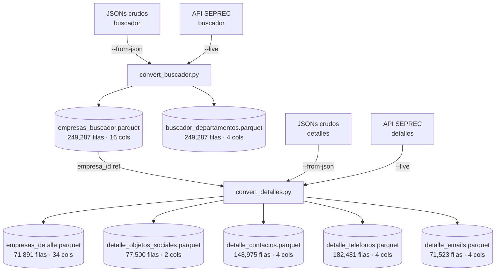

# Pipeline SEPREC — Documentación del Rework

## Arquitectura general



## Scripts creados

| Script | Propósito |
|---|---|
| `scripts/convert_buscador.py` | Convierte JSONs del buscador → Parquets (standalone) |
| `scripts/convert_detalles.py` | Convierte JSONs de detalles → Parquets normalizados (standalone) |
| `scripts/pipeline_seprec.py` | CLI unificado que orquesta ambos pasos |

## Modelo relacional de salida

```
empresas_buscador.parquet          ← tabla principal del buscador
  PK: id (empresa_id)
  ├── buscador_departamentos.parquet
  │     FK: empresa_id → empresas_buscador.id
  │     cols: dep_id, dep_codigo, dep_nombre
  │
  └── (join) empresas_detalle.parquet
        FK: empresa_id / id → empresas_buscador.id
        ├── detalle_objetos_sociales.parquet  (FK: empresa_id)
        ├── detalle_contactos.parquet         (FK: empresa_id)
        ├── detalle_telefonos.parquet         (FK: empresa_id, contacto_id)
        └── detalle_emails.parquet            (FK: empresa_id, contacto_id)
```

## Comandos de uso

### Pipeline completo desde JSONs ya descargados
```bash
python scripts/pipeline_seprec.py full --from-json \
    --buscador-input data/seprec_data/data \
    --detalles-input data/seprec-detail/data \
    --output-dir output/parquet
```

### Pipeline completo en vivo (descarga desde la API)
```bash
python scripts/pipeline_seprec.py full --live \
    --save-raw data/raw \
    --output-dir output/parquet
```

### Solo buscador desde JSONs
```bash
python scripts/pipeline_seprec.py buscador --from-json \
    --input-dir data/seprec_data/data \
    --output-dir output/parquet
```

### Solo buscador en vivo (con guardado de JSONs crudos)
```bash
python scripts/pipeline_seprec.py buscador --live \
    --save-raw data/raw/buscador \
    --palabras a e i o u \
    --output-dir output/parquet
```

### Solo detalles desde JSONs
```bash
python scripts/pipeline_seprec.py detalles --from-json \
    --input-dir data/seprec-detail/data \
    --output-dir output/parquet
```

### Solo detalles en vivo (usa el Parquet del buscador para los IDs)
```bash
python scripts/pipeline_seprec.py detalles --live \
    --buscador-parquet output/parquet/empresas_buscador.parquet \
    --save-raw data/raw/detalles \
    --output-dir output/parquet
```

### Uso standalone (sin pipeline_seprec.py)
```bash
# Buscador standalone
python scripts/convert_buscador.py --from-json --input-dir data/seprec_data/data --output-dir output/parquet
python scripts/convert_buscador.py --live --save-raw data/raw/buscador --output-dir output/parquet

# Detalles standalone
python scripts/convert_detalles.py --from-json --input-dir data/seprec-detail/data --output-dir output/parquet
python scripts/convert_detalles.py --live --buscador-parquet output/parquet/empresas_buscador.parquet --output-dir output/parquet
```

## Estructura de Parquets de salida

### `empresas_buscador.parquet` (tabla principal buscador)
| Columna | Descripción |
|---|---|
| `id` | ID empresa (PK) |
| `estado` | ACTIVO / PENDIENTE |
| `matricula` | Matrícula comercial |
| `matriculaAnterior` | Matrícula anterior |
| `razonSocial` | Nombre empresa |
| `idEstablecimiento` | ID establecimiento |
| `codEstadoActualizacion_id/codigo/nombre` | Estado de actualización aplanado |
| `codTipoUnidadEconomica_id/codigo/nombre` | Tipo unidad económica aplanado |
| `direccion_id` | ID dirección |
| `direccion_codDepartamento_id/codigo/nombre` | Departamento aplanado |

### `buscador_departamentos.parquet` (tabla normalizada)
| Columna | Descripción |
|---|---|
| `empresa_id` | FK → empresas_buscador.id |
| `dep_id` | ID departamento |
| `dep_codigo` | Código departamento |
| `dep_nombre` | Nombre departamento |

### `empresas_detalle.parquet` (tabla principal detalles)
| Columna | Descripción |
|---|---|
| `empresa_id` | FK → empresas_buscador.id |
| `establecimiento_id` | ID establecimiento |
| `id` | ID empresa |
| `nit` | NIT |
| `matricula` / `matriculaAnterior` | Matrículas |
| `razonSocial` | Nombre empresa |
| `mesCierreGestion` | Mes cierre |
| `ultimoAnioActualizacion` | Año actualización |
| `objetos_sociales` | JSON string (ver tabla normalizada) |
| `contactos` | JSON string (ver tablas normalizadas) |
| `codTipoUnidadEconomica_*` | Tipo unidad (aplanado) |
| `codEstadoActualizacion_*` | Estado actualización (aplanado) |
| `direccion_*` | Dirección completa (aplanada) |

### Tablas normalizadas de detalles
| Tabla | FK | Columnas propias |
|---|---|---|
| `detalle_objetos_sociales` | `empresa_id` | `objeto_social` |
| `detalle_contactos` | `empresa_id`, `contacto_id` | `tipo_contacto`, `estado` |
| `detalle_telefonos` | `empresa_id`, `contacto_id` | `tipo_telefono`, `numero` |
| `detalle_emails` | `empresa_id`, `contacto_id` | `tipo_email`, `correo` |

## Resultados de la ejecución de prueba

| Parquet | Filas | Tamaño |
|---|---|---|
| `empresas_buscador.parquet` | 249,287 | 13 MB |
| `buscador_departamentos.parquet` | 249,287 | 2.0 MB |
| `empresas_detalle.parquet` | 71,891 | 29 MB |
| `detalle_objetos_sociales.parquet` | 77,500 | 17 MB |
| `detalle_contactos.parquet` | 148,975 | 1.5 MB |
| `detalle_telefonos.parquet` | 182,481 | 2.3 MB |
| `detalle_emails.parquet` | 71,523 | 2.0 MB |

> [!NOTE]
> Los detalles tienen ~71k registros de 249k posibles porque los JSONs con `"finalizado": false` (empresas sin datos disponibles en la API) son omitidos automáticamente con `SKIP_NO_FINALIZADO`.

## Diferencias con los scripts anteriores

| Aspecto | Scripts anteriores | Scripts reworkeados |
|---|---|---|
| Salida | CSV + JSONL | **Parquet** (más eficiente) |
| Normalización | Todo aplanado en un CSV | **Tablas separadas** por entidad (objetos_sociales, contactos, teléfonos, emails) |
| Modo de operación | Variables hardcodeadas | **CLI con argparse** |
| Pipeline unificado | No existía | `pipeline_seprec.py full` |
| Logging | print() mixto | **JSON estructurado** (timestamp + level + event) |
| Deduplicación | `drop_duplicates()` general | Por `id` (empresa) |
| JSONs inválidos | No los filtraba | Omite `finalizado: false` |
